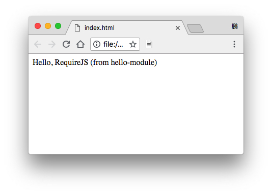

JavaScript RequireJS Demo
=========================

RequireJS是用来在浏览器中加载js模块的，文档写得极其晦涩难懂，不把人看死都写不出来一个hello world。

好在我们现在有webpack了。

```
npm install
npm run demo
```



Resources
---------

- 快速理解RequireJS: <http://freewind.in/posts/2741-understand-requirejs-quickly/>